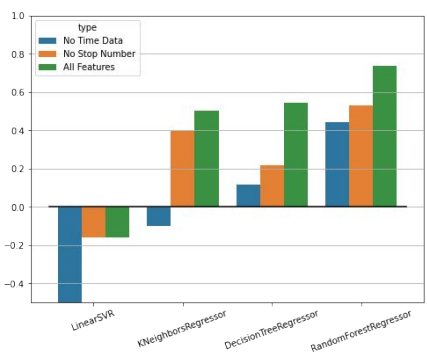

# A Regression Analysis of Winnipeg Transit On-time Performance  in Relation to Traffic Volume

## Key Links
- [Report](Report.pdf)
- [Slides](Slides.pdf)

## About the project
Goal
- The goal of this project is to analyze and model On-Time-Performance of transits in Winnipeg using information about the traffic volume and other factors.
  
Impact:
- Understand which factors can influence bus delays and by how much
- Predict future bus delays

## Datasets
Source Datasets:
1. Winnipeg Transit On-time-Performance Dataset
2. Permanent Count Station Traffic Counts
  - 8 count stations (red marker) are located on the city’s main streets:  McPhillips, Henderson, Disraeli, Pembina, St. Mary’s, Inkster, Marion, & Lagimodiere.
4. Locations of Bus stops
  - 5155 Bus Stops in total across Winnipeg (blue, orange and red) 
  - 1559 Bus Stops are within 2 km to one of the 8 traffic count stations (orange and red)
  - 226 Bus Stops are on the same street as the traffic count stations (red)

  

5. Street Mappings
6. Construction sites and road closure

Preprocessed Dataset:

## Methodology
Supervised Machine Learning:
- Training - Testing split: 75% - 25%
- Randomized test data
  
Regression Models:
- LinearSVR
- DecisionTreeRegressor
- KNeighborsRegressor
- RandomForestRegressor
  
Evaluation: 
- R2 score
- Results are an average of 5 random states

## Findings

Regression works
- RandomForestRegressor is the best model for our data and can predict with up to an r2 score of 0.79 on an average case
- DecisionTreeRegressor and KNeighborsRegressor generally performed decently
- Linear SVR produces an extremely low score, an indication that the relationship is not a linear one

Key features for performance:
- Time factors (Time value, Time of Day, Day of Week and Day of Year) as well as Stop Number were shown to be key contributors to the regression models, as evidenced by the lower score in their absence.
- The regression score is also significantly improved when trained and tested on only bus stops that are on the same street versus bus stops that are on different street to the count station, across all non-linear models.

 

## Obstacles & Future Work

- The findings suggest that the more data the model has access to, the better it 
becomes.
  - This could help improve our regression model even further and more importantly, the ability for the model to predict future delays based on traffic volume
- However, the amount of data that would need to be mined for this process would be immense
  - Data for Transit On-Time Performance for the entire year of 2020 was 91 million entries (11.67 GB)
- Thus we were constrained to working with only 1 to 2 months' worth of data.
  - This might have led to uninteresting findings when it comes to a process as complex as predicting future delays
- Nevertheless, the results still look promising. We expect that this work can be further improved upon in several ways, such as
  - Training the model on more data (e.g. 1 year of data) to make better future predictions
  - Analyzing the prediction data to see which time of day accounts for the most error.
  - Incorporating bus route and their associated stops with the on-time-performance 
  - Taking emergencies such as car accidents, floods, and malfunctioning stop lights into account

## Credit and Acknowledgements
We would like to express our very great appreciation to our professor Dr. Carson K. Leung for providing us with his incredibly valuable guidance and feedback during the development of this 
project. It was instrumental in the completion of our project. We would also like to thank our TAs: Evan Madill, Adam Pazdor, and Qi Wen for their great assistance in our research.

Team Members
- Jase Tran
- Juhee Kim
- Tommy Wu
- Nurida Karimbaeva
- Tanisha Turner
